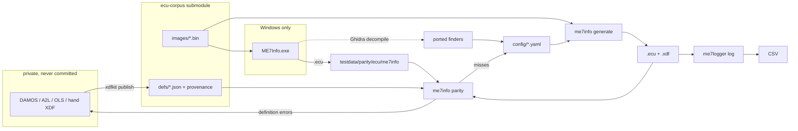

# Developer

## Workflow

Stage new originals in the gitignored `testdata/parity/incoming/`. Definitions are fixed and published in the corpus with xdfkit, then pulled with `make corpus-bump`. ME7Info's `.ecu` output for each image is the only hard 100% oracle.

## Design

`me7info` (`generate`, `probe`, `parity`) and `me7logger` (`log`) share one Go module. Both locate items in the image as `record.Item` and `record.Map`; the `.ecu` and XDF writers read those.

The generator is a masked byte search plus a few opcodes (selector, case bounds, `EXTP`), not a disassembler. A Bosch name located by bytes is a row in `config/signatures.yaml`, never a literal in Go. A row should match a code layout, not one image; check it across the corpus.

Out of scope: `.kp`, OLS, DAMOS, WinOLS, ecuxplot, `mapdump`. Do not copy NefMoto `Communication/`.

## Config

Each file in `config/` documents its fields in its header. `config/user/*.yaml` overlays them in filename order; a row of the same name replaces the shipped one, and `drop: true` removes a needle. `--user`/`ME7_USER` picks another directory. `config/examples/needles.yaml` is not loaded.

Files load from `./config` when it exists, else the embedded copy. `--core`, `--names`, `--meas`, `--map`, `--alias` (or `ME7_*`) replace one file. A built binary does not see edits to the embedded files.

`signatures.yaml` rows run top to bottom, and the first row that hits fills a name. Prepended axis counts become rows and columns only when they account for every byte up to the body; never invent a count of 1. Only named maps reach the XDF.

### Axes on an interpolator call

The body is R12, or R13 page plus R12 low bits. The column header is the first of: an R13 immediate; R15 page with R14 low bits; a RAM load of R14 or R13; the header immediate stored through R12 before `MOV [ram], R4`. A second header loaded near the call is the row; conflicting or missing rows stay unset for `ytable` to fill. A `CALLS` into segment 0 outside the flash image uses the row's own `interp`.

## Logging

KWP `$23` reads at 10400 baud, up to 254 contiguous bytes per request, 55 ms apart, so scattered addresses cut the sample rate. `SamplesPerSecond` is 1 to 50, default 10.

## Parity

Images are in the private [ecu-corpus](https://github.com/nyetlabs/ecu-corpus) submodule (`make corpus`, `make corpus-bump`); oracles are in `testdata/parity`, whose files document themselves. `XDFKIT_CORPUS` points elsewhere; `XDFKIT_REQUIRE_CORPUS=1` fails on a missing corpus.

`make parity` prints the report from shipped config only. `make test` fails only when an image is below 100% against its legacy `ecu/me7info/<image>.ecu`; every other score is coverage.

A name hits when it has an address and its listed axes. Each image's definition is its corpus model JSON. Fix definitions in the corpus, not here. `provenance.origin` `damos`/`a2l` is the reference, and a different address is a miss. `hand` or unset is an oracle only: disagreements still hit and are listed under `hand xdf disagrees`.

The tier grade is the highest S4wiki tier where every name hits or is in `names/absent.yaml`. `confidence` is high for bodies under 16 cells or matching a peer in `datasets.yaml` within two cells or 3%, and low for zero bodies unless every peer is zero.

## Version

`git describe` is the version. Commit subjects use the `cliff.toml` prefixes.
