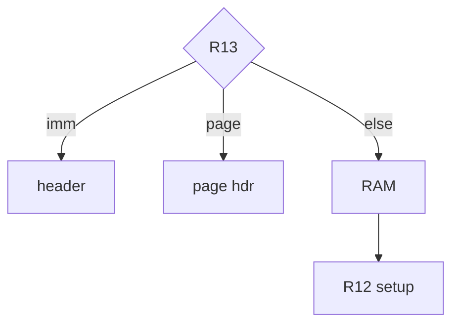
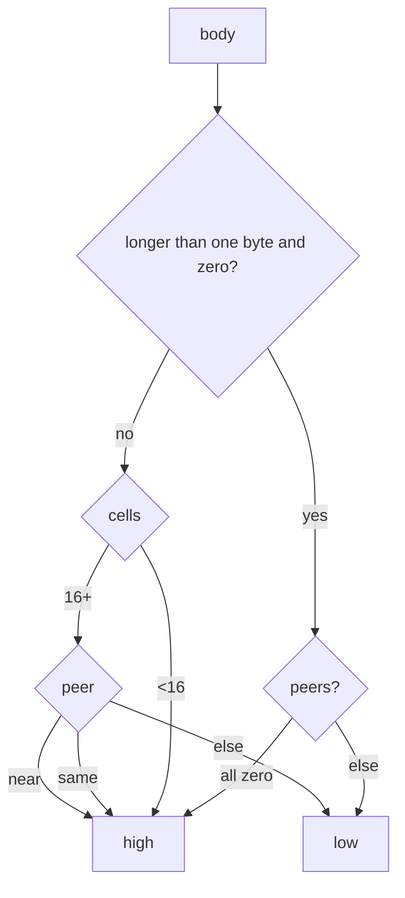

# Developer

## Programs

One Go module, two programs: `me7info` (`generate`, `probe`, `parity`) and `me7logger` (`log`). `log` builds the definition from the image, then samples RAM. Each found item is one record (`record.Item` and `record.Map`). The `.ecu` writer and the XDF writer are peers of that record. An `.ecu` line needs a mask, a conversion, units, and a comm header. An XDF map needs a shape, axes, and an equation.

The generator is a masked search plus a closed set of opcodes (the result-type selector, case bounds, and `EXTP`). It is not a C166 disassembler. A template that only matches after a real decode is a failed needle. Fix that needle in `config/needles.yaml`. A Bosch name located by a signature, a window, or a chain is a row in `config/signatures.yaml`. The bytes, the window, and the call slot are fields on that row.

`Connect` is set from the slow-init needle named by `connect.slow_init_needle` in `config/names.yaml` when that needle has one hit. The line is `SLOW-` plus `prefer_address` when that address is the KWP2000 row, and `fallback_address` otherwise. `--connect` overrides it.

Out of scope: `.kp`, OLS, DAMOS, WinOLS scripts, ecuxplot, and `mapdump`. This tree does not load a needle list from another checkout.

This tree is MIT ([LICENSE](LICENSE)). Do not copy NefMoto `Communication/`. The higher-rate RAM handler is not in this tree.

## Config files

`config/needles.yaml` (`ME7_CORE`, `--core`) holds the result selector, the 5-baud and fast-init rows, and the table and curve interpolation entries (8-bit or 16-bit).

`config/signatures.yaml` is embedded with the other config files. `generate` runs the rows after the selector and after `opcode/sign.go`, so a row can embed a name an earlier row already stored. New rows go in this file.

A pattern can splice in an address that is already known:

- `{name:MID}` is that address in ME7Info's EXTP form.
- `{slot:N}` is `callsSlot(N)`. The word comes from the `calls` table after the bootrom version is chosen by counting calls.

Where the search runs:

- `from` is the CPU search floor.
- `open` is one hit. The `DB00` window around it limits `pattern`. Without `first`, that pattern has to occur once. `first` keeps the first copy when several exist.
- `in` is that window, named by a later row.
- `after` continues from an earlier row's hit through the next `DB00`.
- `absent` skips the row when that pattern is in the range.
- `single` keeps the row only when the pattern occurs once.

How the address is taken from the hit:

- `steps` is a chain. `skip` is the byte distance from the previous hit.
- `at` is the byte distance from the last hit to the address word. It may be negative.
- `also` stores more names from the same hit.

A name already stored stays as it is. A name that is not in the catalog is kept so a later row can embed it, and that name is not written.

`mapsigs` in the same file locates a map the caller list does not name. `pattern` is one window and `XX` is the address word inside it. `at` is the distance from the hit to that word, 2 when omitted. A negative `at` reads the pointer in front of the hit. `add` is the byte distance from the decoded pointer to the body. `anchor` names a map this list already locates, and then `add` is the distance from that map. An anchor uses the base row's axis words when it does not name its own. `open` finds a copy first and limits `pattern` to the DB00 window around it. `first` keeps the first copy of `open` when several exist. `from` is the search floor. An `open` with no `from` starts at 0x820000. `single` keeps that pattern only when it occurs once in the window. `frame` reads the 6-byte segmented pointer at `at`. `far` reads the 4-byte form. `deref` reads that many further words, and `derefat` is added before the first of those reads. `dereffar` makes that read the 4-byte segmented pointer. A hit on a body the caller list located without a name names that map. The hit's axes replace the caller's only when the hit decodes some.

The axes come from one of these:

- `rows` and `cols` are the point counts when the axes are prepended to the body, or when `xat` and `yat` name them. `plain` keeps that count when no axis is stored in front of the body. `xbits` and `ybits` are the breakpoint widths, 8 when that count is set and the width is omitted. The bytes between the counts and the body are that axis data. A curve sets `cols`.
- `xat` and `yat` are byte distances from the hit to an `F2` operand, the RAM word whose setup stored that header. The count byte at the header has to match `cols` or `rows`.
- `table: true` is the breakpoint table itself. The address is the hit, and the row is not a map. `xtable` and `ytable` name that row. The count there has to match `cols` or `rows`.

Axes that are neither prepended nor named that way have no dimensions on the row. A pattern with no `open` is kept only when it occurs once and the address is inside the image. A pattern with `open` keeps the first hit in that DB00 window, unless `single` is set. A later row with the same name fills the map only when an earlier window missed.

When the pointer sits in front of the axes and the counts there account for every byte up to the body, those counts are the rows and the columns. A count the image does not hold stays unset. Do not invent a row count of 1.

A located map is written to the XDF only when it has a name. The XDF unique id is the file offset, the header region is the image length, and an axis whose address is another map in the file links to that id.

`config/maps.yaml` names each map by the caller that passes it to an interpolator. The Bosch name is that call. `at` is the byte distance from the caller label to the `CALLS`, and the address is read there. The row does not store the address.

A second function prologue is another entry under `needles`, and both labels are searched. `at` is a positive even distance, or a list of them when the caller and the interp stay the same. One image matches one distance in the list. A different caller or interp stays its own row.

The call passes the body in R12, or a page in R13 and the low 14 bits in R12.

The column is the axis header on that call. Take the first one that is present:



- **imm** — not a page. That address is the header.
- **page hdr** — R15 page, low 14 bits of R14.
- **RAM** — load of R14, or of R13 when R13 is not an immediate.
- **R12 setup** — the header that setup stored through R12.

The setup is the header immediate in front of `MOV [ram], R4`. An R13 page immediate there overrides the DPP. With no page, the top bits of the header immediate select the DPP. An `F2` of R13 or R14, or an `F0` register move, may sit between that immediate and the reload of the word. An `EXTP #pag,#1` in front of the store, the reload, or the move is skipped, and one may also sit in the argument frame of the call.

Once the column is known, these words are candidates for the row:

- a load of R13, R14, or R15 from a RAM word
- a store of a header immediately before the R12 frame
- a load of R0–R11 from a RAM word immediately before that frame

A candidate whose header is the column is the column index. A candidate whose header is a different axis is the row. Two candidates that name different row headers leave the row unset.

A page call that never loads a row word leaves the row unset. `ytable` on that caller row names a breakpoint table, and `rows` is the count that table must have. The table fills the row only when the call left it unset.

The axis equation is not filled from an address file.

`config/catalog/` (`ME7_MAP`, `--map`; a single file is still accepted) is the RAM result-type catalog. `scales.yaml` holds the scales, `bits.yaml` the bitmask rows, and `values.yaml` the rest. The `.ecu` map name stays `catalog.yaml`.

An omitted field is size 0, bitmask 0, unit "", signed false, inverse false, factor 1, offset 0. A size and unit pair applies only when the size is 1 or 2. A single-bit bitmask is a flag and does not take that pair. A field written on the row is kept.

`config/names.yaml` (`ME7_NAMES`, `--names`) holds ME7 names and conversions. An omitted conversion size is 2. A conversion fills omitted signed, inverse, factor, and offset from a size and a unit. A named conversion is selected with `conversion`. That conversion is not the size-and-unit default, so its unit may be "".

`config/measurements.yaml` (`ME7_MEAS`, `--meas`) is the measurement list. Overlay and field defaults are in the next section.

`config/aliases.yaml` (`ME7_ALIAS`, `--alias`) renames the catalog name. `was` is the previous alias. The Bosch variable name is unchanged. `$1` in an alias is a regex reference. ecuxplot uses it in `loggers.yaml`. It is not a literal.

## config/user

Every `.yaml` and `.yml` file in `config/user/` is read, in filename order, on top of the shipped lists. A later file replaces a needle or measurement of the same name. Files you add there stay out of git. A missing `config/user` is skipped. `--user` and `ME7_USER` select another directory, and that path must exist. The same flag is on `me7info generate`, `me7info probe`, and `me7logger log`.

A release archive includes `config/user/measurements.yaml` and `config/user/maps.yaml`. Each file is the comment header from the shipped list and an empty list.

A later measurement row with the same name replaces the earlier one. A row with no needle is a stub and is not written. `stub: true` on a shipped measurement drops its needle and keeps the scale. A measurement needle belongs on a `measurements` row. The same name under `data` or `functions` is a separate needle.

A measurement row carries the scale and, when the bytes are known, the needle that locates the mem operand. `generate` writes a row that has a needle. A stub is not written.

`bit: true` means the label is an `8A` or `9A` and the word is `0xFD00` plus twice the next byte. When that needle's address is the load in a selector case, the case supplies the result type. The catalog is not asked for that case.

An omitted measurement field is size 2, bitmask 0, unit "", signed false, inverse false, factor 1, offset 0. A row replaces only the fields it lists. `needle_hex` on the row attaches or replaces the needle. It may be a list of patterns, one per code layout. The list shares `back_up`, and `unique` counts every hit. The list is not a selector case. An omitted `back_up` is -4.

A failed measurement pattern is fixed on that row. A failed function pattern stays in `config/needles.yaml`.

A map row is added. Two map rows may share a name. `at` may be a list of distances on that caller and interp. One caller and distance may not. A map row needs `name`, `caller`, `at`, and `interp`.

`config/user/needles.yaml` is where `data` and `functions` rows go. Those rows overlay `config/needles.yaml`. The comment at the top of that file is the field list. A `data` row labels a table or other bytes. A `functions` row labels a function entry.

A row with `needle_hex` replaces that name, or adds it:

```yaml
functions:
  - name: my_caller
    needle_hex: "DA ?? ?? ?? DB 00"
    unique: true
```

`??` is one wildcard byte. Spaces are optional. Only word-aligned hits count. An omitted `unique` is true, so more than one hit is reported and skipped. An omitted `back_up` on a needle row is 0, so the label is the hit. A negative `back_up` moves the label forward. `back_up: [min, max]` needs an even span and `entry_after`. `entry_after` is a list of byte strings, and one of them must precede the label.

A row that omits `needle_hex` updates only the fields it lists, on a needle that already exists:

```yaml
data:
  - name: slow_init_table
    back_up: -2
```

`mask_hex` on that kind of row is the same length as the pattern and is combined with the stored mask by a bitwise AND. A new name without `needle_hex` is an error.

`drop: true` removes a needle that already exists:

```yaml
functions:
  - name: map_interp_table8
    drop: true
```

`config/examples/needles.yaml` holds checksum and flash-kernel rows. Copy the rows you want into `config/user/needles.yaml`. The examples file is not loaded. The programs leave flash and EEPROM alone.

After editing, `me7info probe image.bin` prints `hit`, `miss`, `ambig`, or `noent` for each needle.

## Loading

`config.Path` is `config/<name>` relative to the working directory, or the environment variable when it is set. `Read` and `LoadCatalog` use that directory when it exists, and the embedded copy only when it does not. The user overlay defaults to `config/user`, also relative to the working directory.

Running from the repo reads the source files. Running from anywhere else uses the embed until some other directory happens to be named `config`.

An explicit flag or environment variable replaces one file: `--core`, `--names`, `--meas`, `--map`, `--alias`, and `ME7_CORE`, `ME7_NAMES`, `ME7_MEAS`, `ME7_MAP`, `ME7_ALIAS`. `signatures.yaml` has no override flag. `config/examples/needles.yaml` is not embedded.

Editing a shipped file and running `go test` or `go run` rebuilds the embedded copy. A binary that was already built does not see that edit unless a flag or environment variable points at the file.

## Logging

`me7logger` samples with KWP `$23` (`ReadMemoryByAddress`). Names that sit next to each other are one read of at most 254 bytes. Each further span is another request, and `Pace` waits P3 (55 ms) between them. One contiguous span can approach the samples-per-second cap. Scattered addresses divide the rate by the number of spans. `$2C` defines one address and is not the sample path.

Logging stays at the init baud, 10400. A higher `LogSpeed` in the `.ecu` is left as written and is not switched.

A log cfg may set `SamplesPerSecond` from 1 through 50. Omitted, it is 10. A line starting with `;` or `#` is a comment. An alias is `name alias` or `name{alias}`. A relative `ECUCharacteristics` path is relative to the cfg file.

## Parity

The sample images come from the private [ecu-corpus](https://github.com/nyetlabs/ecu-corpus), a git submodule at `corpus/`. Their oracles are in this repo, under `testdata/parity`. A release archive includes neither. Clone the repo, fetch the corpus, then run the check from that checkout.

With read access to `ecu-corpus`, `make corpus` fetches the submodule at its pinned commit. `make corpus-bump` moves it to the corpus head; commit the change yourself. The submodule URL is HTTPS. To use SSH, run `git config --global url.git@github.com:.insteadOf https://github.com/`. Without access, `corpus/` stays empty and `make test` skips the tests that read images. `XDFKIT_CORPUS` points the tests and `me7info parity` at another corpus checkout. `XDFKIT_REQUIRE_CORPUS=1`, set in CI, makes a missing corpus a failure. xdfkit's `docs/corpus.md` is the corpus specification.

`make parity` builds `build/me7info` and runs `me7info parity --data testdata/parity`, which reads the images from `corpus/` (`--corpus`). It prints a report and exits 0.

`make test` fails when any image is short of 100% on `vs ecu-specific`. That column is the image against `ecu/me7info/<image>.ecu`, matched on name, address, size, and bitmask. It is the only hard 100%.

A row that file does not name stays. Catalog names located on that image which the file does not name are a separate count. Extras are not in that count. The other scores are coverage, and a shortfall there does not fail the image.

`vs corpus` is that image against every name in `config/catalog/` (`values.yaml` and `bits.yaml`). It is not 100% on every binary.

Do not point `generate` at the oracle files without `-o` and `--xdf` aimed somewhere else.

That run reads the shipped YAML. It does not read `config/user`. Adding files there leaves the score unchanged. A drop means a shipped file in `config/` changed.

`testdata/parity/images.yaml` lists the images by their name in the corpus manifest, `corpus/corpus.tsv`. Each is read from `corpus/images/<image>.bin`, and every oracle uses the same name. `ecu/me7info/<image>.ecu` is the legacy ME7Info file for that image. `datasets.yaml` lists images by that name too. `testdata/parity/incoming/` is not scored.

`layouts.yaml` groups the images into code layout blocks: images likely to share needle variants and map locations. An image is listed by its Bosch software number, or by its EPK string when it carries no software number. `layouts-priority.yaml` puts each block in one finder tier. It is opinion. `TestLayoutBlocks` fails when an image is in no block or in two, when a listed id is not an image, when the members of a block share no needle variant that some image lacks, or when a block is missing from the priority file or repeated in it.

A `*-priority.yaml` file is a `tiers` map. The tiers are `S`, `A`, `B`, `C`, and `D`, highest first. Any other key fails the load.

`xdf/s4wiki/names.yaml` is one name list, scored on every image. The tuner set is <https://s4wiki.com/wiki/Tuning>. It is not a per-CPU list, and not a second 100%.

`xdf/s4wiki/names-priority.yaml` puts every name on that list in one finder tier. It is opinion and does not change a score. Parity fails when a name is missing, repeated, or not on the list.

A name hits when the locator stores one address and an axis. A count of 0 on that list is a scalar, so the address alone is the hit. Any other body with no axis is a miss. When `xdf/<image>.xdf` contains the name, the body address has to match one row of that file. A DAMOS export lists a map whose axes are stored in front of the body with no axis addresses, at the count header in front of the first axis. That row also matches.

The number on the list is how many axes the table has, and those counts are the `axis` column. A count of 0 adds nothing. The denominator is 0 only when every map that hit has a count of 0. A count of 1 is a curve and 2 is a map. A hit on that column is the axis present on the map.

`xdf/<image>.xdf`, when present, checks that image's own address file. A missing file is omitted from the report. The file is not the S4wiki list, and it does not locate maps. A body hit is the same address. An axis hit is the same address, point count, and width. An axis with no address is left out of the score. A 16-bit axis or body is the even address. The odd byte in front of it is a pad, not a value.

Maps are located on that image from the caller that passes the map to the interpolator. How the column and the row are read is in the `config/maps.yaml` section above. `addMapAt` reads the row and column counts when they sit in front of the axes. A count the image does not hold stays unset, and that map is written as a constant, unless the row is `plain`. A mapsig row names a header with `xat` or `yat` when a setup stored it in a RAM word.

`confidence` scores the body bytes of the names that hit. The denominator is that matched set. A name the locator missed is not in it, and neither is the axis count. `testdata/parity/confidence.yaml` lists names left out of that score on every image. Those names stay on the S4wiki list.



- **peers** — every sibling that has this name. None means low.
- **peer** — another image of the same dataset.
- **near** — at most two cells differ, or 3% of the cells on a larger map, and both neighbors match.

Peers are the images grouped in `testdata/parity/datasets.yaml`. A shared axis does not lower the body.

The report sections are:

- `ecu me7info` is the legacy file, then a count of catalog names that file does not name, then that image against the full catalog. The `extras` column is the measurement list on that image. The torque scale is the `torque` conversion in `config/names.yaml`.
- `xdf s4wiki` is the shared name list, then its `axis` column, then `confidence`.
- `xdf` is every body in the per-image address file. Its `axis` column is every axis in that file.

Every section lists images by the tier of the image's block in `layouts-priority.yaml`, then by name. An image in no block sorts last.

## Version

`git describe` is the only version string (`vX.Y.Z`, `vX.Y.Z-rcN`). Do not edit one by hand. Commit subjects use the prefixes in `cliff.toml`. `.github/workflows/release.yml` publishes `build/me7info` and `build/me7logger`. Stable notes skip rc tags.
