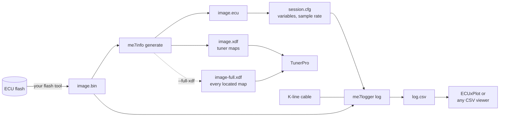
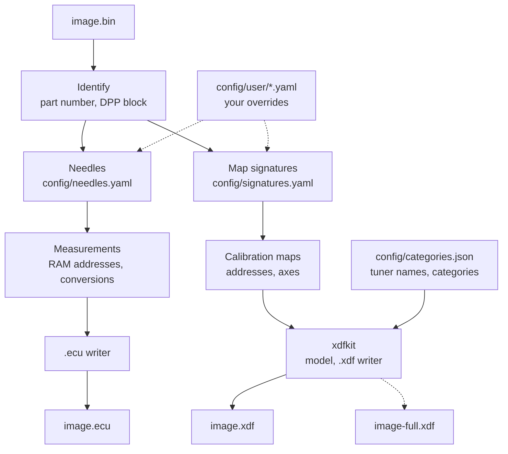
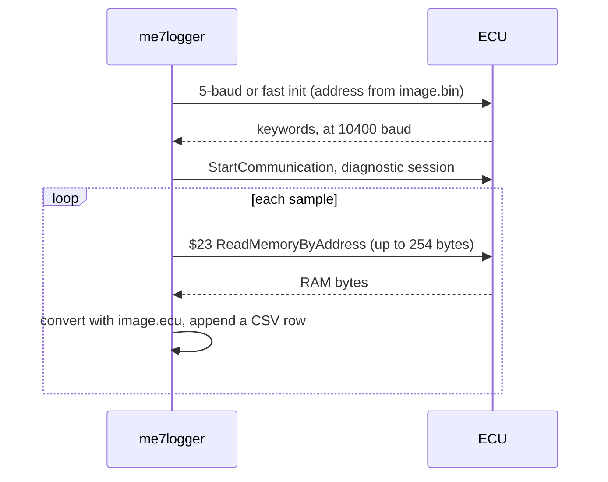
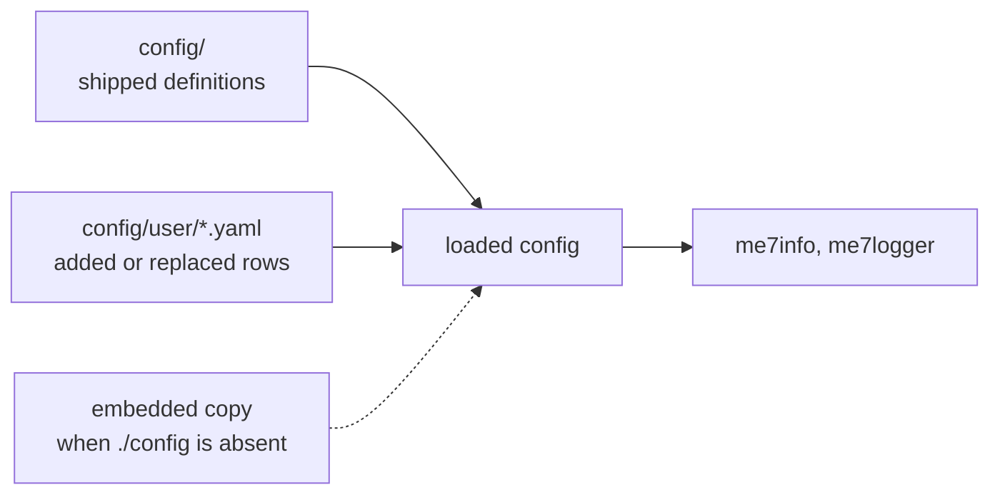

# me7-logger

Tools for Bosch ME7 engine control units, in Go, for macOS, Linux and Windows.

| Program | Does | Reads | Writes |
|---|---|---|---|
| `me7info` | Locates measurements and calibration maps in a flash image | `image.bin` | ME7Logger `.ecu`, TunerPro `.xdf` |
| `me7logger` | Samples ECU RAM over the K-line diagnostic port | `image.bin`, `session.cfg` | CSV |

Neither program writes flash or EEPROM. `me7info` never opens a serial port.

## Workflow



1. Read the flash image from the ECU with a flash tool. These programs don't read flash.
2. `me7info generate image.bin` writes `image.ecu`, plus `image.xdf` when it locates calibration maps.
3. List the variables to log in `session.cfg`, pointing at `image.ecu`.
4. `me7logger log -p PORT -o log.csv image.bin session.cfg` logs until Ctrl-C.

Commands, the `session.cfg` format and user overrides: [QUICKSTART.md](QUICKSTART.md).

## What `me7info generate` does



- Measurements are found by masked byte patterns ("needles") and a few decoded instructions, not by disassembling the whole image.
- Each Bosch map name and the bytes that locate it are a row in `config/signatures.yaml`.
- `image.xdf` holds the maps named in `config/categories.json`, filed under its categories, plus the maps at their axis addresses. `--full-xdf` writes every located map, with the rest under `Other`.
- `me7info probe image.bin` reports what was found without writing files. With `--maps`, it also prints how many maps each XDF would hold, and any axis constant it couldn't turn into a breakpoint curve.

## How `me7logger` reads RAM



- Logging stays at 10400 baud. Each request reads up to 254 contiguous bytes, so variables spread across RAM lower the sample rate.
- `SamplesPerSecond` in `session.cfg` is 1 to 50, default 10; `-s` overrides it.
- `-1` reads one sample and stops, as a connection check.

## Configuration



Run from the directory that contains `config/`: an unpacked release, or a checkout after `make`. Each file documents its fields in its header. Rows in `config/user/` with the same name replace the shipped ones; `--user` or `ME7_USER` picks another directory.

## Install

Release archives for macOS, Linux and Windows (amd64; arm64 for macOS and Linux) are on the [releases page](https://github.com/nyetlabs/me7-logger/releases). Unpack one and run the programs from that directory.

From source, with Go installed:

```bash
make          # runs the tests, builds build/me7info and build/me7logger
make help     # all targets
```

## Development

[DEVELOPER.md](DEVELOPER.md) covers the design, the config files, the parity scoring against legacy ME7Info output, and the private image corpus the tests use.

Related projects:

- [xdfkit](https://github.com/nyetlabs/xdfkit): converts map definitions between WinOLS KP, TunerPro XDF and JSON, and publishes the corpus map packs. `me7info` writes its XDF and reads the corpus definitions with it.
- [ecu-corpus](https://github.com/nyetlabs/ecu-corpus) (private): flash images and their map definitions, shared by the test suites.

## Releases

`make package` writes `dist/`. Tag `vX.Y.Z` publishes it; `-rcN` is a prerelease.

## Warning

Under heavy development, and history is rewritten often. Expect to `git reset --hard origin/master`. Nothing is a public contract yet: config formats, flags and output can change without notice.

## License

MIT, see [LICENSE](LICENSE).
